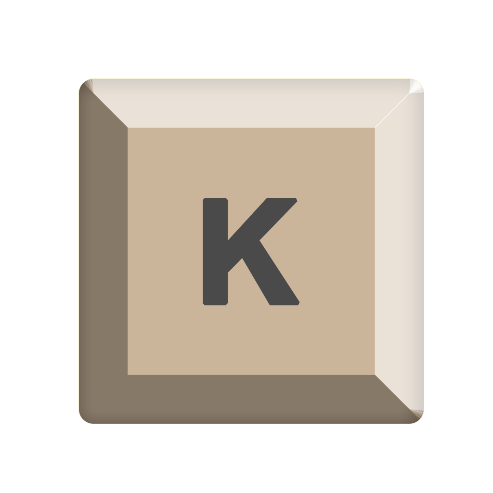
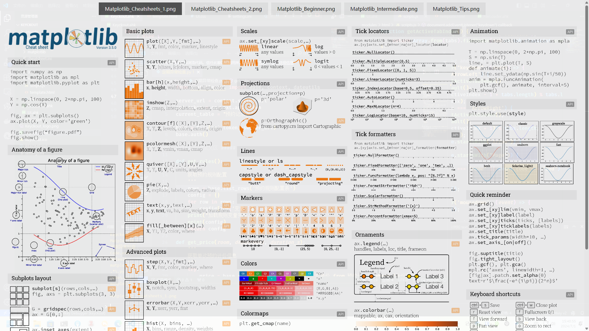

# Keyckout 

  
 
 Keyckout 是一个使用 [AutoHotKey V2](https://www.autohotkey.com/) 编写的快速参考小抄 Windows 应用，你可以在大多数的应用中长按 `Win` 呼出你配置的小抄。



目前，本插件支持的小抄格式：

+ 图片（`pic`）：可以被常规浏览器直接加载的图片。
+ HTML（`html`）：可以被浏览器直接加载的 HTML 文件，不需要完整的格式（也就是只需要`<body></body>`标签内的部分）。


## 使用方法

### 依赖关系

+ AutoHotKey V2
+ WebView2 Runtime: 程序界面部分采用 WebView2，所以需要使用者安装有该运行时。但是较新版本的 Windows10 和所有 Windows11 一般会自带。

### 配置小抄

`cheatsheet`目录下放置了各种不同的小抄分组，由文件`cheatsheet.ini`管理。

`cheatsheet.ini`中定义了每个文件夹下面是什么类型的小抄，并且如何与当前激活的窗口匹配。

例如：

```ini
[default]
Type = pic
Files = Keyckout.png

;注意每个section（方括号[]内）必须与当前目录下的文件夹匹配
[matplotlib]
;小抄类型
Type = pic
;匹配窗口标题
MatchTitle = .*\.py
;匹配进程名
MatchProcess = Code\.exe
;相关的小抄文件，多个文件用“,”分割，不支持空格！
Files = Matplotlib_Cheatsheets_1.png,Matplotlib_Cheatsheets_2.png,Matplotlib_Beginner.png,Matplotlib_Intermediate.png,Matplotlib_Tips.png
```

其中，`[default]`是没有匹配结果时默认显示的小抄，而下面的`[vscode]`则是自定义的小抄。

目前，匹配机制为：

1. 与运算：窗口标题与进程名匹配是与的关系，也就是两个条件都匹配时，才视为匹配成功。
2. 多匹配结果自动合并：如果有多个小抄都满足匹配条件，则自动合并展示。

### 使用小抄

长按`Win`键并保持，会唤起小抄。

之后，一旦松开`Win`键，小抄窗口会消失。

如有多个文件，则界面上会有多个标签。在这个界面上，只有部分按键是可以用的，其功能分别为：

+ `←`/`→`：左右切换多个小抄的标签。
+ `↑`/`↓`/鼠标滚轮：上下滚动。
+ `PageUp`/`PageDown`：较快地上下滚动。
+ `Home`/`End`：跳转至当前小抄的开头/结尾。

### 退出方式

右键系统托盘图标，点击“Exit”。

## 许可与鸣谢

本程序采用[MIT](https://opensource.org/licenses/MIT)协议开源。

在制作本程序的时候，使用了以下优秀的项目：

+ [AutoHotKey](https://www.autohotkey.com/)
+ WebView2.ahk 相关组件：[ahk_lib](https://github.com/thqby/ahk2_lib)
+ 演示文件：[Matplotlib Cheatsheets](https://github.com/matplotlib/cheatsheets)
